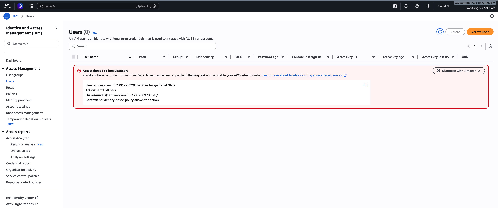

# DevOps Assessment – AWS Microservices Deployment

> **Note on live testing**
>
> The AWS account provided for this assessment does not have sufficient IAM permissions to create an IAM user, generate access keys, or call `iam:ListUsers`. As a result, it was not possible to configure AWS CLI credentials and run `terraform apply` against a live account.
>
> All Terraform code has been written and validated locally (`terraform init`, `terraform fmt`, `terraform validate`, `tflint` — all pass with zero errors). The implementation is based on the assumption that a properly privileged AWS account is available. The logic, resource definitions, and wiring are correct and should deploy successfully given the right credentials.
>
> 


## Architecture

Two Flask microservices are containerised, pushed to Amazon ECR, and deployed on EC2 via an Auto Scaling Group (min 2 / desired 2 / max 4). An Application Load Balancer routes traffic by path prefix.

```
Internet
   │
   ▼
┌──────────────────────────────────────┐
│   Application Load Balancer (port 80) │
│   /service1* ──► TG-service1 (8080)  │
│   /service2* ──► TG-service2 (8081)  │
└──────────┬──────────────┬────────────┘
           │              │
    ┌──────▼──────┐ ┌──────▼──────┐
    │  EC2 inst 1 │ │  EC2 inst 2 │  (ASG, t2.micro, Ubuntu 24.04)
    │  service1:8080 │ │  service1:8080 │
    │  service2:8081 │ │  service2:8081 │
    └─────────────┘ └─────────────┘
           │
    ┌──────▼──────┐
    │  Amazon ECR  │
    │  service1    │
    │  service2    │
    └─────────────┘
```

**AWS Region:** `ap-northeast-2` (Seoul)

---

## Project Structure

```
.
├── servers/
│   ├── service1/          # Flask app – routes: /, /service1, /health (port 5000)
│   ├── service2/          # Flask app – routes: /, /service2, /health (port 5001)
│   └── docker-compose.yml # Local dev compose (builds from source)
├── terraform/
│   ├── main.tf            # Provider + Ubuntu 24.04 AMI data source
│   ├── variables.tf       # Input variables
│   ├── outputs.tf         # ALB DNS, ECR URIs, ASG name
│   ├── vpc.tf             # VPC, 2 public subnets, IGW, route tables
│   ├── ecr.tf             # ECR repos: service1, service2
│   ├── iam.tf             # EC2 role (ECRReadOnly + SSM) + instance profile
│   ├── security_groups.tf # ALB-SG (80 public) + EC2-SG (SSH + 8080/8081 from ALB)
│   ├── alb.tf             # ALB + 2 target groups + listener + path rules
│   ├── launch_template.tf # Launch Template with userdata bootstrap
│   ├── asg.tf             # ASG min=2/desired=2/max=4 + CPU target-tracking policy
│   ├── userdata.sh.tpl    # Bootstrap: Docker install, ECR login, compose up
│   └── terraform.tfvars.example
├── docker-compose.yml     # EC2 compose file (ECR images, ports 8080/8081)
└── verify_endpoints.sh    # Bash verification script
```

---

## Prerequisites

- [Terraform](https://developer.hashicorp.com/terraform/install) >= 1.0
- [AWS CLI v2](https://docs.aws.amazon.com/cli/latest/userguide/install-cliv2.html) configured (`aws configure`)
- [Docker](https://docs.docker.com/get-docker/) with `buildx` support
- An AWS account with permissions for EC2, ECR, ELB, IAM, VPC

---

## Deployment Steps

### 0. Verify services locally

```bash
cd servers
docker compose up -d
curl http://localhost:5000/health   # {"status":"healthy"}
curl http://localhost:5001/health   # {"status":"healthy"}
docker compose down
```

### 1. Create ECR repositories and full infrastructure

```bash
cd terraform
cp terraform.tfvars.example terraform.tfvars
# Edit terraform.tfvars: set aws_account_id and my_ip
terraform init
terraform plan -var-file=terraform.tfvars
terraform apply -var-file=terraform.tfvars
```

### 2. Build and push images to ECR

```bash
# Build for linux/amd64 (required when building on Apple Silicon)
docker buildx build --platform linux/amd64 -t service1:latest servers/service1
docker buildx build --platform linux/amd64 -t service2:latest servers/service2

# Authenticate with ECR (copy the command from terraform output)
terraform -chdir=terraform output -raw ecr_login_command | bash

# Tag and push
ECR_SERVICE1=$(terraform -chdir=terraform output -raw ecr_uri_service1)
ECR_SERVICE2=$(terraform -chdir=terraform output -raw ecr_uri_service2)
docker tag service1:latest $ECR_SERVICE1:latest
docker tag service2:latest $ECR_SERVICE2:latest
docker push $ECR_SERVICE1:latest
docker push $ECR_SERVICE2:latest
```

### 3. Wait for instances to become healthy

```bash
# ASG launches 2 instances; user-data installs Docker and starts services (~3-5 min)
aws autoscaling describe-auto-scaling-groups \
  --auto-scaling-group-names $(terraform -chdir=terraform output -raw asg_name) \
  --query 'AutoScalingGroups[0].Instances[*].HealthStatus'
```

### 4. Run the verification script

```bash
chmod +x verify_endpoints.sh
ALB_DNS=$(terraform -chdir=terraform output -raw alb_dns_name)
./verify_endpoints.sh $ALB_DNS
```

Expected output:
```
=== ALB endpoint checks: http://<ALB_DNS> ===

  GET /service1                                 OK    (HTTP 200)
  GET /service2                                 OK    (HTTP 200)
  GET /unknown → 404                            OK    (HTTP 404)

=== ECR repository checks ===

  ECR repo: service1                            OK    (123456789012.dkr.ecr.ap-northeast-2.amazonaws.com/service1)
  ECR repo: service2                            OK    (123456789012.dkr.ecr.ap-northeast-2.amazonaws.com/service2)

=== All checks passed ===
```

---

## Auto Scaling Configuration

| Setting | Value |
|---------|-------|
| Min instances | 2 |
| Desired instances | 2 |
| Max instances | 4 |
| Scale-out policy | CPU utilisation > 40% (target tracking, 5 min warmup) |

To observe scale-out:
```bash
aws autoscaling describe-scaling-activities \
  --auto-scaling-group-name $(terraform -chdir=terraform output -raw asg_name)
```

---

## Cleanup

Destroy all AWS resources to avoid ongoing charges:

```bash
terraform -chdir=terraform destroy -var-file=terraform/terraform.tfvars
```

> **All AWS resources have been torn down after verification.**
